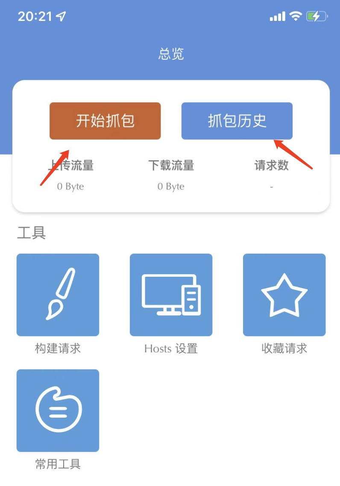
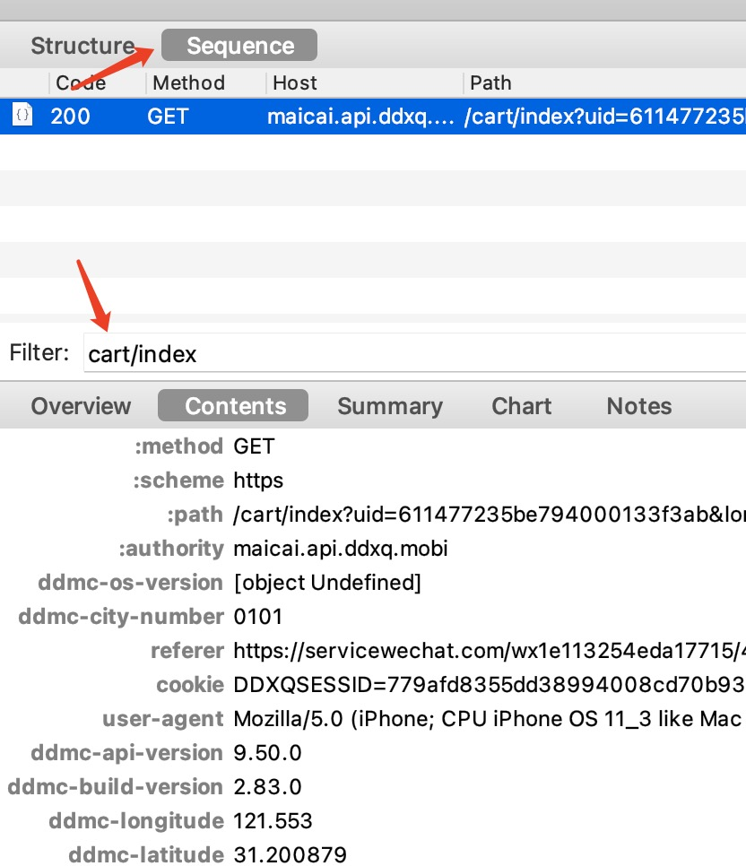

## 叮咚抢菜(dingdong-grapper)
叮咚抢菜(dingdong-grapper)为了解决在微信叮咚小程序抢菜难的问题，本人也是苦于实在抢不到菜，无奈只有发挥程序员的主观能动性开发抢菜软件了，只是为了能吃上饭。

### 运行模式
本程序暂时只提供两种模式。
1. 人工模式: 程序运行即开始抢菜
2. 定时模式: 定时抢菜，事先订好时间，叮咚默认是早上5:59:50和8:29:50开始抢菜

### 使用教程
程序基于用户提供的用户数据运行，并不是直接根据手机号登录即可抢菜(这个需要开发小程序配合，后续会继续开发，这样用户只需要输入手机号和验证码即可开始抢菜了)， 所以第一步用户提供的数据获取至关重要，也是最难的一步。

#### 1. 获取用户数据
####  手机端
- 苹果: 安装[Stream](https://blog.csdn.net/qq_36502272/article/details/117341718)(免费)
1. 安装完成后打开Stream，点击开始抓包
   
2. 打开微信-叮咚买菜-登录-购物车，经过这些步骤后，点击stream中抓包历史
   
3. 点击最新的抓包日期显示抓包全部请求
   
4. 点击全部请求页面右上角搜索，输入 cart/index，确定
   
5. 即可找到对应的请求地址，点击进去详情，在请求信息和请求头部中寻找以下参数:
   - ddmc-device-id：填入pkg/user/config.go deviceId参数中
   - 请求头部的Cookie：填入pkg/user/config.go cookie参数中
   - 请求头部的ddmc-uid：填入pkg/user/config.go uid参数中
   - 请求头部的User-Agent：填入pkg/user/config.go userAgent参数中
   - 请求信息的s_id：填入pkg/user/config.go sid参数中
   - 请求信息的device_token：填入pkg/user/config.go deviceToken参数中
   
6. 直接运行cmd/main.go,保持网络畅通，默认在5:59:50和08:29:50开始抢菜，长时间运行一定要注意用户登录信息过期
- 安卓: 本人无安卓手机，暂无推荐

#### Mac
1. 根据教程安装[Charles](https://blog.csdn.net/z2181745/article/details/123002569)， 可参考[破解网站](https://macwk.com/soft/charles)破解
2. 打开电脑端微信-叮咚买菜-登录-购物车，切换到Sequence结构，在filter里搜索cart/index, 然后输入以下参数
- ddmc-device-id：填入pkg/user/config.go deviceId参数中
   - 请求头部的Cookie：填入pkg/user/config.go cookie参数中
   - 请求头部的ddmc-uid：填入pkg/user/config.go uid参数中
   - 请求头部的User-Agent：填入pkg/user/config.go userAgent参数中
   - 请求信息的s_id：填入pkg/user/config.go sid参数中
   - 请求信息的device_token：填入pkg/user/config.go deviceToken参数中
     
3. 直接运行cmd/main.go,保持网络畅通，默认在5:59:50和08:29:50开始抢菜，长时间运行一定要注意用户登录信息过期
#### Windows
暂无Windows电脑，无法提供相关教程

### 注意！注意！注意！
1. 一定要设置买菜地址为默认地址，否则程序无法正常工作