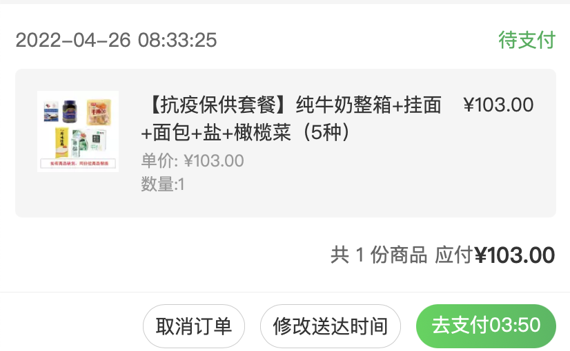
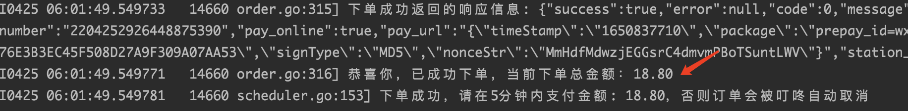
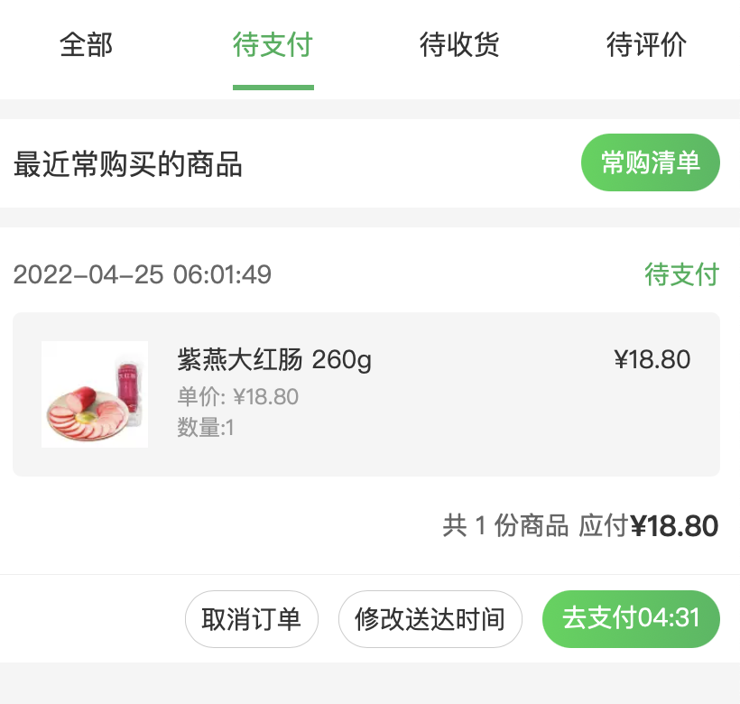

# 叮咚抢菜(dingdong-grapper)

叮咚抢菜(dingdong-grapper)为了解决在微信叮咚小程序因疫情原因在上海抢菜难的问题，本人也是苦于实在抢不到菜，无奈只有发挥程序员的主观能动性开发抢菜软件，只是为了能吃上饭。

经过本人和身边朋友亲测，事先(最好在凌晨12点左右)将菜品放入购物车，在6:00前或者8:30前运行程序是可以抢到的。

# 新的抢菜方案

最近使用者反应自身账号受到了风控，基于旧版本的抓取的HTTP接口抓取可能已经成为过去式了。恰逢五一放假，准备研究研究新的抢菜方案，擅长这方面的童鞋欢迎一起在`Issues`里讨论。

# 04-26 抢菜更新

今天睡过了，6:00的抢菜没有尝试，试了8:30的，抢菜仍然有效。




# 04-25 抢菜更新

今天本人亲测，目前程序仍是可以有效下单和完成付款流程的。






# 重大更新！重大更新！重大更新！

增加了签名算法添加`nars`和`sesi`，防止请求被风控返回`抱歉人多拥挤，请稍后再试`错误

签名非法返回的错误:

```
{
    "msg": "抱歉人多拥挤，请稍后再试",
    "code": -3000,
    "timestamp": "2022-04-22 22:31:02",
    "success": false,
    "exec_time": null
}
```

# 问题issue或者需求

大家如果遇到问题或者有更合适的需求的话，可直接在Github的Issues提问或者给出建议，我会及时关注，尽量解决和满足合理的需求。

# 运行策略

本程序暂时只提供两种策略。

1. 人工策略: 程序运行即开始抢菜，此策略下程序默认出于保护只会跑2分钟，如果没有商品库存，则会立即停止
2. 定时策略: 定时抢菜，事先订好时间，叮咚默认是早上5:59:50和8:29:50开始抢菜，这种策略要避免启动过早导致用户登录信息过期。
3. 哨兵策略: 捡漏模式，长期运行捡漏可配送时间, 不错过任何叮咚可配送时间。

# 使用教程

`dingdong-grapper`需要用户提供`Cookie`才可运行， 所以第一步用户需要通过抓包软件抓取相关的API提取`Cookie`。相关的API:

```
获取用户信息: https://sunquan.api.ddxq.mobi/api/v1/user/detail/
获取用户买菜地址: https://sunquan.api.ddxq.mobi/api/v1/user/address/    
勾选购物车所有商品地址: https://maicai.api.ddxq.mobi/cart/allCheck
获取购物车商品地址: https://maicai.api.ddxq.mobi/cart/index
预约送达时间地址: https://maicai.api.ddxq.mobi/order/getMultiReserveTime
获取确认订单地址: https://maicai.api.ddxq.mobi/order/checkOrder
提交订单地址: https://maicai.api.ddxq.mobi/order/addNewOrder
```

## 1. 获取`Cookie`

新版本`2.85.x`改变了原来请求地址，但是获取收获地址的API并没有改变，所以无论何种客户端，可以点击微信叮咚小程序`我的`-`收获地址`， 然后在抓包软件中输入`user/address`获取`Cookie`

- [iPhone获取`Cookie`](教程/cookie/iphone.md)
- [Android获取`Cookie`](教程/cookie/android.md)
- [Mac获取`Cookie`](教程/cookie/mac.md)
- [Windows获取`Cookie`](教程/cookie/windows.md)

## 2. 填写`Cookie`

- 将`Cookie`填入`main.go` cookie参数中

## 3. 运行

### IDE直接运行

可以使用[Goland](https://www.jetbrains.com/go/download/#section=mac) 或者[VS Code](https://code.visualstudio.com/download)
等IDE运行。填写完用户参数后，直接运行main.go, 默认在5:59:50和08:29:50开始抢菜，长时间运行一定要注意用户登录信息过期

- 如果没有安装Golang环境，请根据[教程/安装Go环境](教程/安装Go环境)安装
- 定时策略: 默认即为定时策略
- 人工策略: 运行此策略需要在`main.go`修改`strategy`字段值0，此策略下程序默认出于保护只会跑2分钟，如果没有商品库存，则会立即停止。
- 哨兵策略: 运行此策略需要在`main.go`修改`strategy`字段值2，此策略下程序会长期运行，直到无商品库存。

### Docker运行

Docker运行隔离了对Go等其他环境的依赖，可以直接运行

- 后续将更新上传docker image

# 注意！注意！注意！

1. 一定要设置买菜地址为默认地址，否则程序无法正常工作