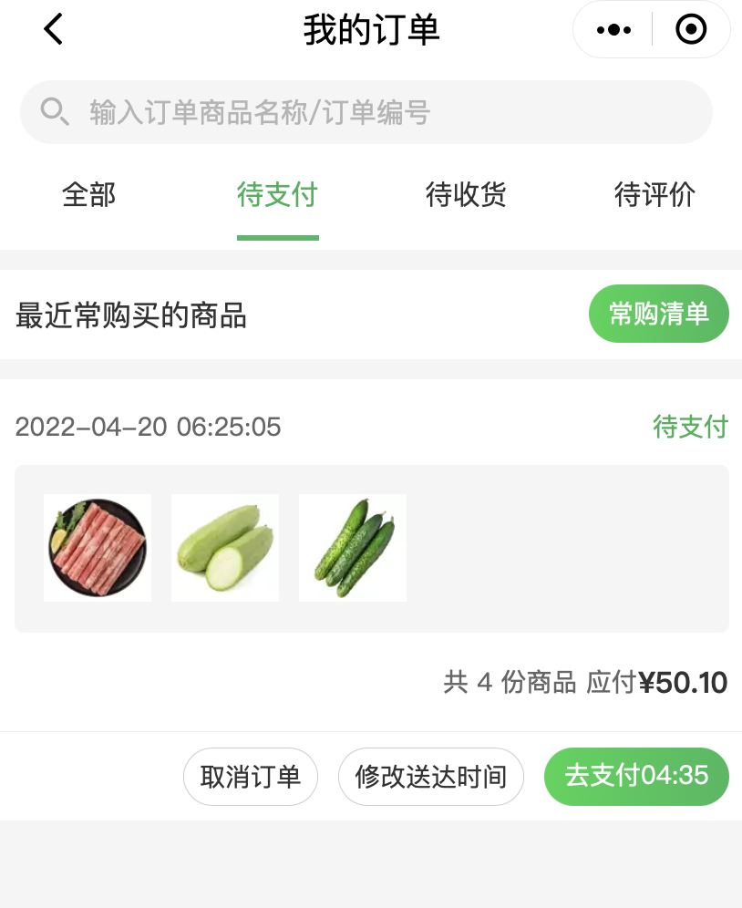
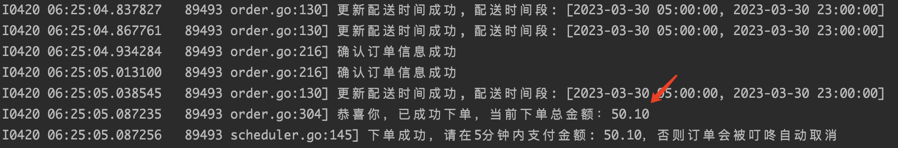

# 叮咚抢菜(dingdong-grapper)

叮咚抢菜(dingdong-grapper)为了解决在微信叮咚小程序因疫情原因在上海抢菜难的问题，本人也是苦于实在抢不到菜，无奈只有发挥程序员的主观能动性开发抢菜软件，只是为了能吃上饭。

经过本人和身边朋友亲测，事先(最好在凌晨12点左右)将菜品放入购物车，在6:00前或者8:30前运行程序是可以抢到的。

# 问题issue或者需求
大家如果遇到问题或者有更合适的需求的话，可直接在Github的Issues提问或者给出建议，我每隔1h左右会看一眼，可以一起商量讨论，我会尽量解决和满足合理的需求。

#  4-21 抢菜更新
居然在凌晨12点多预抢到了，叮咚不是只在6:00和8:30开始预约吗? 这挺奇怪的，不过好在有捡漏模式监测到了。正在提供捡漏模式监控捡漏，后续更新捡漏模式代码，可以实时监测。

#  4-20 抢菜更新
事实证明确实可以帮助身边的朋友抢到菜，挺开心的

# 运行策略

本程序暂时只提供两种策略。

1. 人工策略: 程序运行即开始抢菜，此策略下程序默认出于保护只会跑2分钟，如果没有商品库存，则会立即停止
2. 定时策略: 定时抢菜，事先订好时间，叮咚默认是早上5:59:50和8:29:50开始抢菜，这种策略要避免启动过早导致用户登录信息过期。

# 使用教程

程序基于用户提供的用户数据运行，并不是直接根据手机号登录即可抢菜(这个需要开发小程序配合，后续会继续开发，这样用户只需要输入手机号和验证码即可开始抢菜了)， 所以第一步用户提供的数据获取至关重要，也是最难的一步。

## 1. 获取用户参数

- [iPhone获取用户参数](教程/获取用户参数/iphone.md)
- [Android获取用户参数](教程/获取用户参数/android.md)
- [Mac获取用户参数](教程/获取用户参数/mac.md)
- [Windows获取用户参数](教程/获取用户参数/windows.md)

## 2. 填写用户参数

- 请求头部的`Cookie`：填入`main.go` cookie参数中
- 请求头部的`ddmc-uid`：填入`main.go` uid参数中

## 3. 运行

### IDE直接运行

可以使用[Goland](https://www.jetbrains.com/go/download/#section=mac) 或者[VS Code](https://code.visualstudio.com/download)
等IDE运行。填写完用户参数后，直接运行main.go, 默认在5:59:50和08:29:50开始抢菜，长时间运行一定要注意用户登录信息过期

- 如果没有安装Golang环境，请根据[教程/安装Go环境](教程/安装Go环境)安装
- 定时策略: 默认即为定时策略
- 人工策略: 运行此策略需要在`main.go`修改`strategy`字段值0，此策略下程序默认出于保护只会跑2分钟，如果没有商品库存，则会立即停止。

### Docker运行

Docker运行隔离了对Go等其他环境的依赖，可以直接运行

- 后续将更新上传docker image

# 注意！注意！注意！

1. 一定要设置买菜地址为默认地址，否则程序无法正常工作