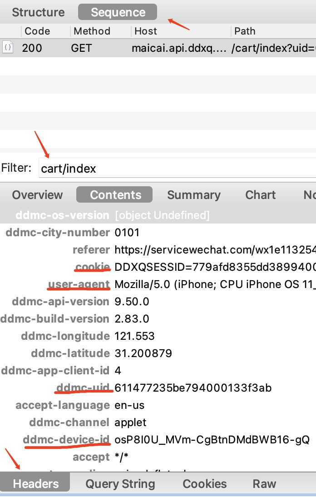

### Mac获取用户参数教程

1. 安装[Charles](https://www.charlesproxy.com/download/latest-release/)
2. 破解Charles: 下载[MacWk](https://macwk.com/soft/charles) 破解，下载完成后打开破解软件，选择激活步骤双击，会弹出相关的激活码(包含Registered Name和License Key)
3. 打开Charles，在Help->Registered to, 输入Registered Name和License Key提交破解即可
4. [配置Charles抓包PC端微信小程序](https://blog.csdn.net/z2181745/article/details/123002569)
5. 打开电脑端微信-叮咚买菜小程序-登录-购物车，或者我的-收货地址，切换到Sequence结构，在filter里搜索cart/index或者user/address, 在下方Header查找`Cookie`。
   如果搜索无结果，可以根据以下API的关键字搜索，如`api.ddxq.mobi`, `user/detail`, `user/address`, `allCheck`
   , `getMultiReserveTime`等
   ```
   获取用户信息: https://sunquan.api.ddxq.mobi/api/v1/user/detail/
   获取用户买菜地址: https://sunquan.api.ddxq.mobi/api/v1/user/address/    
   勾选购物车所有商品地址: https://maicai.api.ddxq.mobi/cart/allCheck
   获取购物车商品地址: https://maicai.api.ddxq.mobi/cart/index
   预约送达时间地址: https://maicai.api.ddxq.mobi/order/getMultiReserveTime
   获取确认订单地址: https://maicai.api.ddxq.mobi/order/checkOrder
   提交订单地址: https://maicai.api.ddxq.mobi/order/addNewOrder
   ```

   