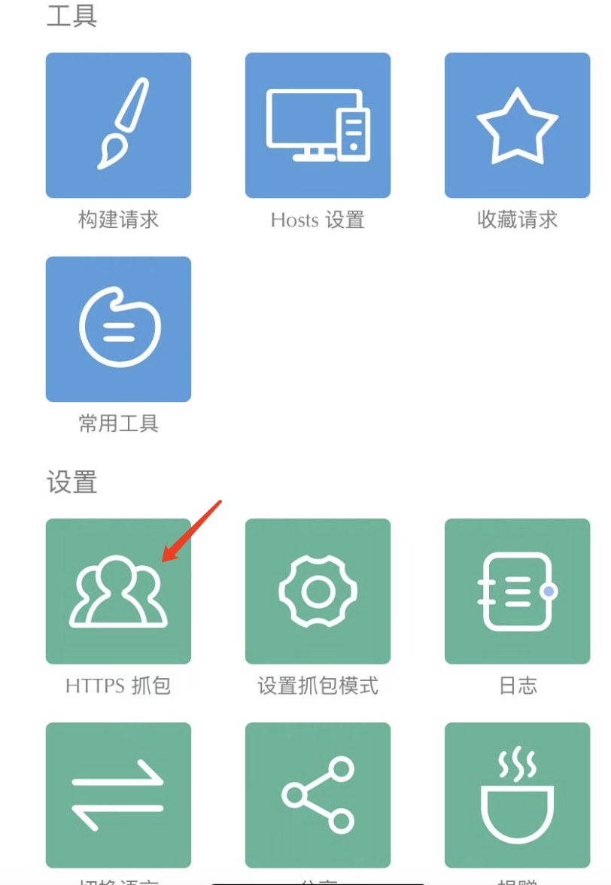
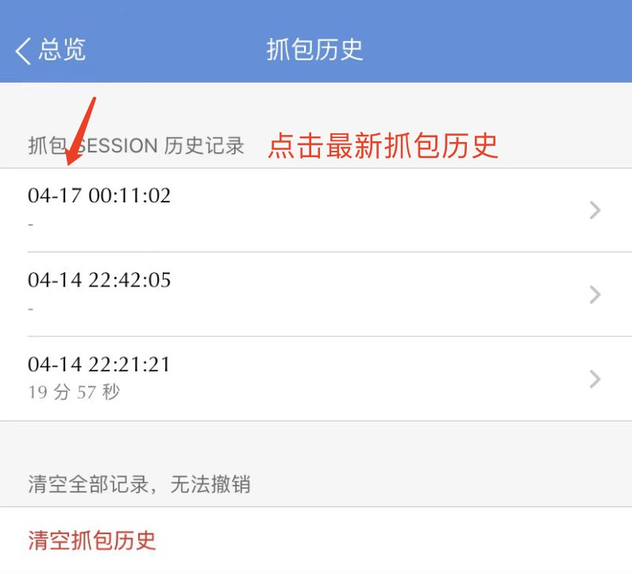
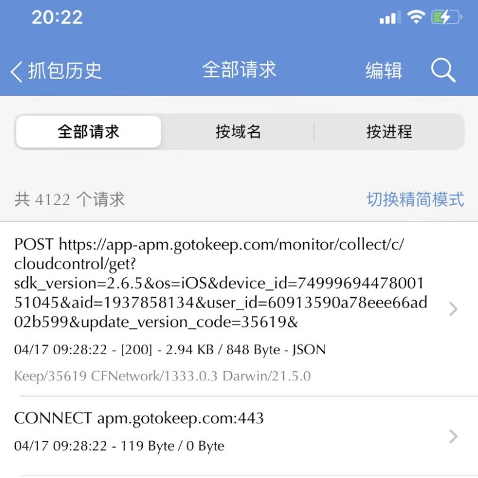
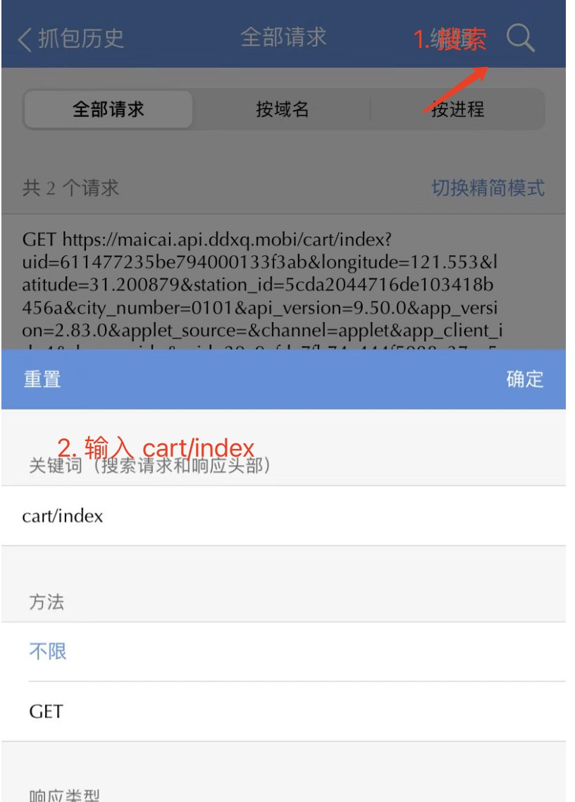
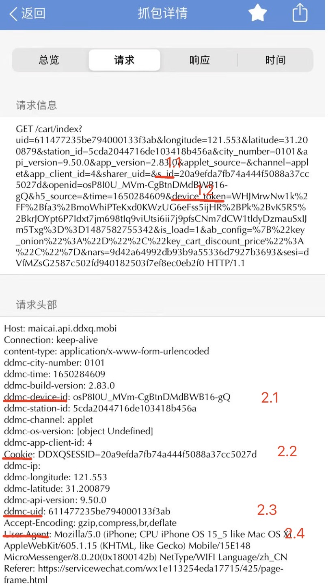

### iPhone获取用户参数教程
安装[Stream](https://blog.csdn.net/qq_36502272/article/details/117341718)(免费)
1. Stream安装完成后，点击设置下的`HTTPS抓包`，根据提示安装CA证书

   

2. 安装证书后点击开始抓包

   

3. 打开微信-叮咚买菜小程序-登录-购物车，经过这些步骤后，点击stream首页`抓包历史`

   

4. 点击最新的抓包日期显示全部请求

   

5. 点击全部请求页面右上角搜索，输入`cart/index`后确定

   

6. 即可找到对应的请求地址，点击进去详情，在请求信息和请求头部中寻找以下两项参数即可

  - 请求头部的`Cookie`
  - 请求头部的`ddmc-uid`

   
7. 